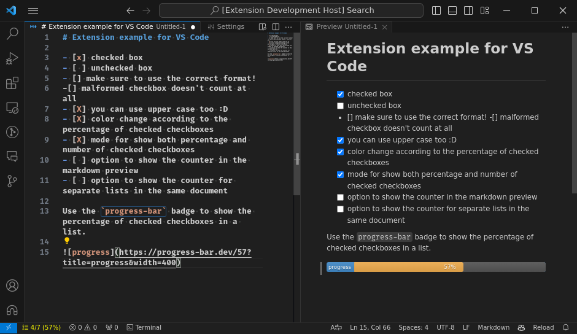

# Checkbox Enhancement



This extension is designed to enhance the functionality of the checkbox in
markdown files. It is designed to work with the markdown preview and the
markdown editor.

I'm using this extension to learn how to create a Visual Studio Code extension
while also solving a problem that I have. I hope you find it useful too.

> [!NOTE]
> This extension is in development. If you find any bugs or have any feature requests, please open an issue on the [GitHub repository](https://github.com/jamerrq/checkbox-md-enhancement)


## Features

Once activated, the extension will show a counter in the status bar of Visual Studio Code. The counter will show the number of checked checkboxes and the percentage of checked checkboxes in the document.

- You can change the format of the counter by clicking on it or executing the `Checkbox Enhancement: Change Counter Format` command.

    https://github.com/jamerrq/checkbox-md-enhancement/assets/35697365/50e085ad-989c-4ca0-a538-8789f476ea95

- To show/hide the counter, you can use the `Checkbox Enhancement: Toggle Counter`
command.

- The counter will be updated every time you save or change the document and the color of the counter will change according to the percentage of checked checkboxes.


More features will be added in the future.

## Release Notes

Check the [CHANGELOG.md](CHANGELOG.md) file for the release notes.

## Recommendations

You can use this extension alongside
[`progress-bar.dev`](https://progress-bar.dev) to show the progress of your
checkboxes in your markdown files.

### Usage

Create a list of checkboxes in your markdown file and use the following format:

```markdown
- [x] really cool feature
- [ ] another cool feature but not as cool as the first one
- [X] an important task!
- [ ] a task that is not so important


```

And you will get the following result:


## Contributing

Contributions / asking for features are welcome. Feel free to open an issue or a
pull request on the [GitHub
repository](https://github.com/jamerrq/checkbox-md-enhancement) of the project.

These are some of the features that I would like to add in the future:

- [X] Color change according to the percentage of checked checkboxes
- [X] Mode for show both percentage and number of checked checkboxes
- [ ] Option to show the counter in the markdown preview
- [ ] Option to show the counter for separate lists in the document

To contribute, clone the repository first:

```bash
git clone git@github.com:jamerrq/checkbox-md-enhancement.git
```

Then, install the dependencies:

```bash
cd checkbox-md-enhancement
pnpm install
```

After that, you can open the project in Visual Studio Code and start developing.
Use the `F5` key to start the extension in a new window.
I strongly recommend creating a new branch for your changes.

```bash
git checkout -b feature/my-new-feature
```

When you are done, you can open a pull request on the GitHub repository.

## For more information

* [Visual Studio Code's Markdown Support](http://code.visualstudio.com/docs/languages/markdown)
* [Markdown Syntax Reference](https://help.github.com/articles/markdown-basics/)

## About the Author

[](https://jamerrq.deno.dev/)
